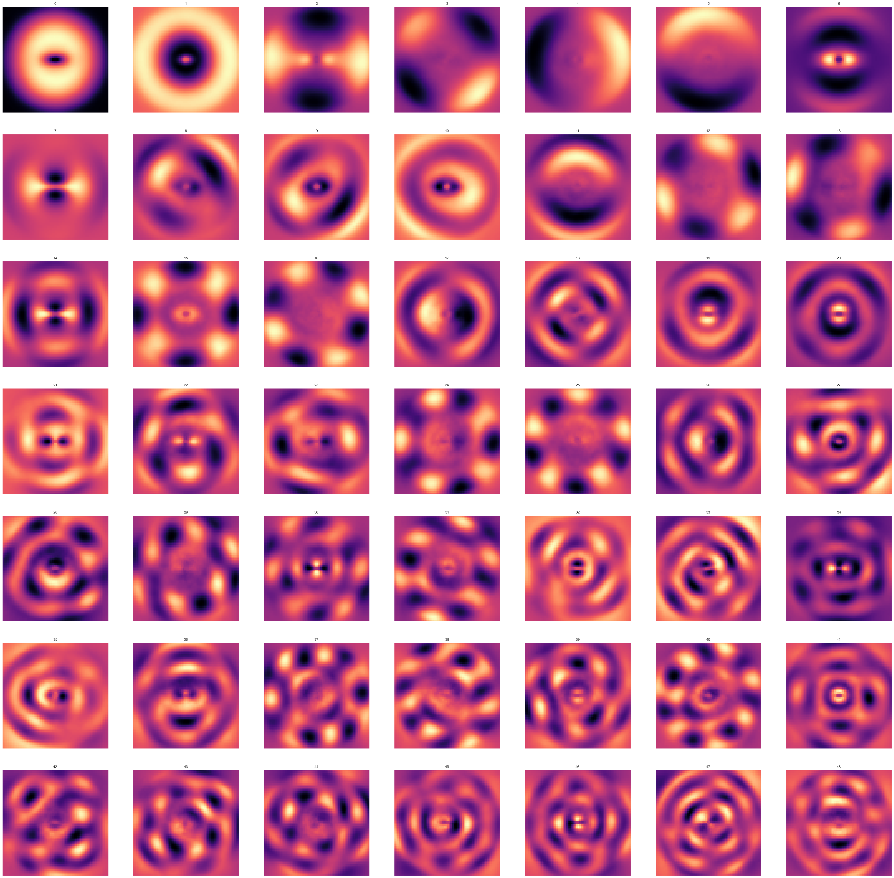
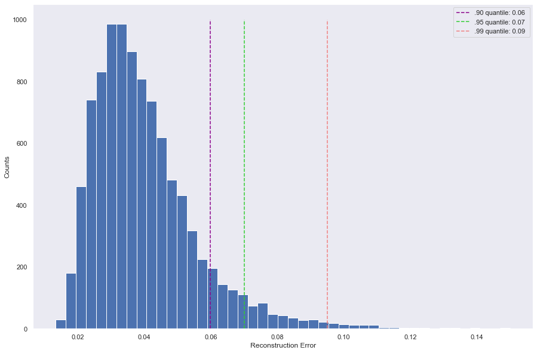
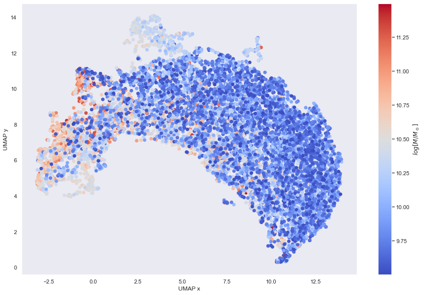

# Machine Learning Models For Galaxy Morphology

This is the GitHub repository for my bachelor thesis in physics at the Heidelberg University. Interactive visualizations and animations can be found on my [personal  Webpage](https://www.cakir-ufuk.de/bachelor-thesis)

# Introduction
State-of-the-art hydrodynamical simulations can reproduce the diversity of different galaxy morphological types, but fail to exactly recreate real, observed galaxies.
In the last decade, machine learning (ML) had very promising results in image recognition and dimensionality reduction.
The goal of my thesis is to investigate how ML can be used to create galaxy morphology models and encode the information contained in modern state-of-the-art simulations.

I used IllustrisTNG simulated galaxies to build a galaxy morphology model.

## Principal Component Analysis
The main part is to investigate of how principal component analysis(PCA) can serve as a galaxy morphology model. The so called "Eigengalaxies" calculated from PCA are galaxy images which act as the basis vectors of the image space such that each galaxy in the dataset can be described through a linear combination of all eigengalaxies.

The calculated Eigengalaxies are:

Projecting galaxy images onto the space spanned by the eigengalaxies we get a low dimensional representation

We find that 99% of the images in our simple PCA morphology model have a reconstuction error less than 9%, as seen in the folowing Figure:

### PCA in three dimension

I have further calculated PCA on three dimensional data to get the 3D eigengalaxies, which can be viewed interactively on my [Webpage](https://www.cakir-ufuk.de/bachelor-thesis)

Example of Eigengalaxy 10:

### UMAP Projection
Calculating UMAP projection on the PCA scores to see if clusters of different galaxy types arise.

The resulting Figure can also viewed on my [Webpage](https://www.cakir-ufuk.de/bachelor-thesis), where hovering over a point will show the galaxy image.

## Generative Advesarial Neural Network
Traininieren des [StyleGAN2-ada](https://github.com/NVlabs/stylegan2-ada) 

